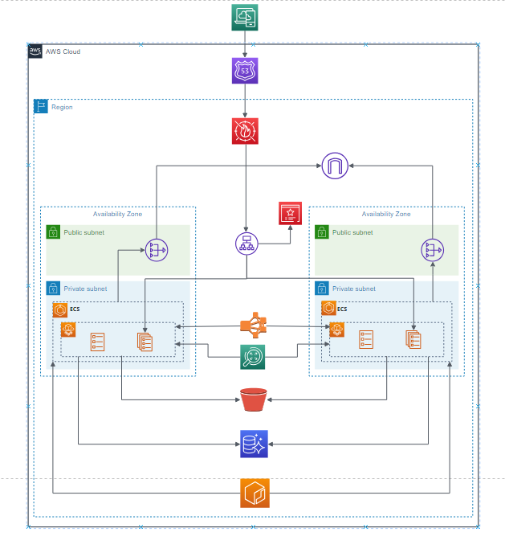

# Deployment Manual: OCR

## 1. Introduction

This document provides a detailed description of the architecture,
tech stack and deployment process for the OCR. The system is designed to use facial recognition technology (OCR) to improve the check-in process.

## 2. Tech Stack

\- Servicios AWS:

\- Route 53 (para gestión de dominios)

\- Certificate Manager (ACM)

\- Web Application Firewall (WAF)

\- Internet Gateway

\- NAT Gateway

\- Application Load Balancer (ALB)

\- Elastic Container Service (ECS)

\- Elastic Container Registry (ECR)

\- Aurora Serverless MySQL

\- Simple Storage Service (S3)

\- Rekognition

##  3. System Architecture

#### 3.1 OCR system

This architecture diagram represents a cloud deployment in
AWS, designed for high availability, scalability and security in
multiple availability zones. The architecture takes advantage of several
AWS services to ensure resiliency, accessibility, and
ability to handle advanced workloads, such as data analytics
images.

The OCR system allows:

\- Automatic face capture using AI

\- Capture of Chilean identity cards for verification during the check-in

**3.1.1 Componentes:**

1.  **Availability Zones:** The configuration uses two Availability Zones to improve the fault tolerance of the application. When deploying resources to multiple Availability Zones (AZs), the architecture can continue to function even if an AZ becomes unavailable.

2.  **Public Subnets:** Each Availability Zone contains a public subnet. Resources on these subnets can be accessed direct to the internet. These subnets are typically used for services that need to be accessible from outside the network AWS, such as load balancers or public applications.

3.  **Private Subnets:** Each Availability Zone also has a private subnet. Resources within these subnets do not have direct internet access, which adds an extra layer of security. These subnets are ideal for backend services, databases and other resources that must remain isolated from the public internet.

4.  **Route 53 (DNS Service):** At the top of the diagram, AWS Route 53 is responsible for domain name resolution, routing end user requests to resources appropriate within the architecture.

5.  **WAF (Web Application Firewall):** The Web Application Firewall provides protection against common web exploits, ensuring that only legitimate traffic reaches the application.

6.  **Elastic Load Balancer (ELB):** The ELB is located in front of the application, distributing incoming traffic between ECS tasks that run in different Availability Zones. This ensures that the load is evenly distributed and that the application remains available even if one or more ECS tasks fail.

7.  **ECS (Elastic Container Service):** ECS clusters are deployed to private subnets within each Availability Zone. These clusters manage Docker containers, allowing scalable deployment of microservices or application components. ECS orchestrates the execution of these containers, ensuring that they are always available and can handle incoming requests.

8.  **Amazon Rekognition:** Amazon Rekognition, a service that provides image and video analysis capabilities, is integrated into the architecture. It is used to analyze images and videos automatically for tasks like detection objects, facial recognition and content moderation. The ECS tasks can invoke Rekognition to process files multimedia stored in S3, allowing processing images within the app.

9.  **Internet Gateway:** An Internet Gateway is associated with the public subnets, providing a way for resources in these subnets to communicate with the Internet.

10. **NAT Gateway:** The NAT Gateway allows instances in private subnets access the internet for updates or to use AWS services without exposing these instances to traffic incoming from the internet.

11. **Security Groups:** Security groups are used to control the incoming and outgoing traffic. These act as virtual firewalls, ensuring that only authorized traffic can access the various resources.

12. **S3 Bucket:** Amazon S3 is used for storage objects, providing a scalable and secure place to store static files, logs, backups or other data. The S3 bucket can be accessed by ECS services, Amazon Rekognition, or other components within the architecture.

13. **Amazon Aurora:** Amazon Aurora Serverless MySQL is used as relational database service. Aurora is designed to be highly available, scalable and compatible with MySQL and PostgreSQL.

**3.1.2 Workflow:**

1.  **DNS Resolution and Security:** User requests are routed via Route 53, which resolves the name of domain and direct traffic to the Web Application Firewall (WAF). The WAF filters incoming traffic to protect against malware threats. common security.

2.  **Load Balancing:** The filtered traffic then reaches Elastic Load Balancer (ELB), which distributes the load between ECS tasks that run in both Availability Zones. This ensures a uniform distribution and high availability

3.  **ECS and Application Logic:** ECS tasks, which run on private subnets handle the application logic. It communicates with the Amazon Aurora database for retrieving and data storage, and can interact with the S3 bucket for static assets.

4.  **Media Processing with Rekognition:** When the application need to analyze images for OCR, ECS tasks interact with Amazon Rekognition. Rekognition processes the files multimedia stored in S3 and returns the results of the analysis to the application for further processing or storage.

5.  **Internet access:** If ECS tasks need to access internet (for example, for updates or interacting with APIs external), they do it through the NAT Gateway, maintaining the security of private subnets

This architecture is robust, designed for high availability,
security, scalability and advanced processing capabilities
media using Amazon Rekognition. Using Amazon Aurora
provides a highly relational database solution
available, fault tolerant and scalable. This ensures that the
application can handle different levels of traffic, protect itself
against threats, perform complex image analysis, and remain
operational even in the event of failures in entire Availability Zones.

## 4. AWS Deployment of Facial Recognition (OCR)

#### 4.1 Amazon Aurora

1\. Access the AWS console and go to RDS.

2\. Click "Create Database."

3\. Under Engine Options, choose Amazon Aurora (MySQL compatible).

4\. Select the engine version (Aurora MySQL 3.05.2).

5\. In Settings, select "Self-managed" and set the
master password.

6\. In Instance Configuration, select Serverless v2 and configure
Minimum and maximum ACU.

#### 4.2 Route 53

1\. Sign in to the AWS console and navigate to Route 53.

2\. In the navigation menu, choose "Domains" and then "Domains
registered".

3\. On the registered domains page, choose "Register domains."

4\. Find the domain you want to register.

5\. Select the domain and proceed to payment.

#### 4.3 AWS Certificate Manager

1\. Sign in to the AWS console and navigate to ACM.

2\. In the navigation menu, choose "Certificates."

3\. Change the region to us-east-1.

4\. Choose "Request a certificate."

5\. In the "Domain Names" section, enter your domain name.

6\. Add the root domain (example.com) and a wildcard subdomain
"*".

7\. Choose "Request."

8\. Click Create Records in Route 53 to create DNS records
for automatic domain validation.

#### 4.4 Simple Storage Service (S3)

1\. Sign in to the AWS console and open Amazon S3.

2\. Select the region where you want to create the bucket.

3\. In the left navigation pane, choose "Buckets."

4\. Click "Create bucket."

5\. Enter a name for your bucket.

6\. Click "Create bucket."

#### 4.5 IAM

1\. On the console home page, select the IAM service.

2\. In the navigation pane, select "Users" and then "Create
user".

3\. Enter the username.

4\. Under Permissions Options, select "Attach policies
directly".

5\. Grant access to S3 and Rekognition.

6\. Choose "Create User."

7\. Under Security Credentials, choose "Create Access Key."

8\. Select the use case.

9\. Assign a description tag and choose "Create
access".

## 5. Final Steps

1.  Create the access key for the user who has AdministratorAccess.

2.  Download and install AWS CLI

> https://docs.aws.amazon.com/cli/latest/userguide/getting-started-install.html

3.  Configure AWS CLI using **aws configure**.

4.  Enter access key, secret access key of the user you created above,
    > use us-east-1 in the region, and json in the format.

5.  Go to ECR console.

6.  Create reposiory for OCR.

7.  Select the ECR repository of the project and click
    > click on **View push commands**.

8.  Run the commands one by one in the respective project.

9.  After the images have been sent to ECR. change the
    > directory to the cdk folder.

10. Run **cdk** **synth**.

11. Run **cdk** **bootstrap**.

12. Run **cdk** **deploy**. Wait until the
    > implementation

